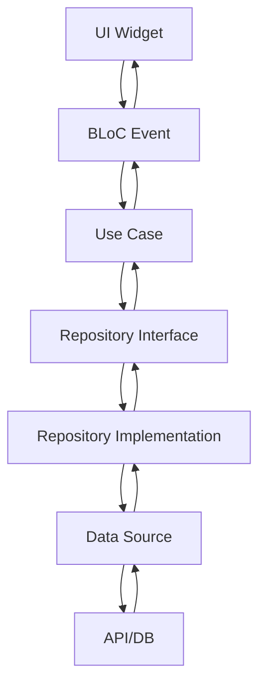

# 🏗️ Clean Architecture - المساعد الطبي الذكي

## 📋 نظرة عامة على البنية

تم تطبيق **Clean Architecture** مع **BLoC State Management** و **Dependency Injection** لضمان:

- ✅ **فصل الاهتمامات** (Separation of Concerns)
- ✅ **قابلية الاختبار** (Testability)
- ✅ **قابلية الصيانة** (Maintainability)
- ✅ **قابلية التوسع** (Scalability)
- ✅ **استقلالية الإطار** (Framework Independence)

## 🏛️ طبقات البنية

### 1. **Domain Layer** (طبقة المجال)
```
lib/features/[feature]/domain/
├── entities/          # الكائنات الأساسية
├── repositories/      # واجهات المستودعات
└── usecases/         # حالات الاستخدام
```

**المسؤوليات:**
- تعريف قواعد العمل
- الكائنات الأساسية
- واجهات المستودعات
- حالات الاستخدام

### 2. **Data Layer** (طبقة البيانات)
```
lib/features/[feature]/data/
├── datasources/      # مصادر البيانات
│   ├── local/        # محلية
│   └── remote/       # بعيدة
├── models/           # نماذج البيانات
└── repositories/     # تطبيق المستودعات
```

**المسؤوليات:**
- تنفيذ مصادر البيانات
- تحويل البيانات
- تنفيذ المستودعات
- إدارة التخزين المؤقت

### 3. **Presentation Layer** (طبقة العرض)
```
lib/features/[feature]/presentation/
├── bloc/            # إدارة الحالة
├── pages/           # الصفحات
└── widgets/         # المكونات
```

**المسؤوليات:**
- إدارة الحالة (BLoC)
- واجهة المستخدم
- التفاعل مع المستخدم

## 🔧 التقنيات المستخدمة

### **State Management: BLoC**
```dart
// Event
class SendMessageEvent extends ChatEvent {
  final String message;
}

// State
class ChatLoaded extends ChatState {
  final List<ChatMessage> messages;
}

// Bloc
class ChatBloc extends Bloc<ChatEvent, ChatState> {
  // Logic here
}
```

### **Dependency Injection: GetIt + Injectable**
```dart
@injectable
class ChatRepositoryImpl implements ChatRepository {
  // Implementation
}

// Registration
@InjectableInit()
Future<void> configureDependencies() async {
  // Auto-generated
}
```

### **HTTP Client: Dio**
```dart
@injectable
class ChatRemoteDataSource {
  final Dio dio;
  
  Future<String> sendMessage(String message) async {
    // Dio implementation
  }
}
```

### **ChatGPT Integration: chat_gpt_sdk**
```dart
@injectable
class ChatRemoteDataSource {
  final OpenAIService openAIService;
  
  Future<String> sendMessage(String message) async {
    final request = ChatCompleteText(
      model: 'gpt-4',
      messages: [/* messages */],
    );
    return await openAIService.onChatCompletion(request: request);
  }
}
```

## 📁 هيكل المشروع

```
lib/
├── core/                    # الطبقة الأساسية
│   ├── constants/           # الثوابت
│   ├── di/                  # Dependency Injection
│   ├── errors/              # معالجة الأخطاء
│   └── network/             # معلومات الشبكة
├── features/                # الميزات
│   ├── chat/                # ميزة المحادثة
│   │   ├── data/            # طبقة البيانات
│   │   ├── domain/          # طبقة المجال
│   │   └── presentation/    # طبقة العرض
│   └── medical/             # ميزة الطب
│       ├── data/
│       ├── domain/
│       └── presentation/
└── shared/                  # المكونات المشتركة
    ├── widgets/
    └── utils/
```

## 🔄 تدفق البيانات



## 🧪 الاختبار

### **Unit Tests**
```dart
// Test Use Case
class MockChatRepository extends Mock implements ChatRepository {}

void main() {
  group('SendMessage', () {
    test('should return success when message is sent', () async {
      // Test implementation
    });
  });
}
```

### **Widget Tests**
```dart
// Test BLoC
void main() {
  testWidgets('ChatScreen displays messages', (tester) async {
    await tester.pumpWidget(
      BlocProvider(
        create: (context) => MockChatBloc(),
        child: ChatScreen(),
      ),
    );
  });
}
```

## 🚀 المميزات

### **1. Clean Architecture Benefits**
- **فصل الطبقات**: كل طبقة مستقلة
- **سهولة الاختبار**: كل مكون قابل للاختبار
- **قابلية الصيانة**: كود منظم وواضح
- **قابلية التوسع**: إضافة ميزات جديدة بسهولة

### **2. BLoC State Management**
- **إدارة الحالة**: مركزية ومنظمة
- **اختبار الحالة**: سهولة اختبار الحالات
- **إعادة الاستخدام**: منطق قابل للإعادة
- **التتبع**: تتبع تغييرات الحالة

### **3. Dependency Injection**
- **حقن التبعيات**: تلقائي ومنظم
- **سهولة الاختبار**: Mock objects
- **إدارة دورة الحياة**: تلقائية
- **قابلية التكوين**: مرونة في التكوين

### **4. ChatGPT SDK Integration**
- **تكامل مباشر**: مع OpenAI API
- **أداء محسن**: استجابة أسرع
- **إدارة الأخطاء**: معالجة متقدمة
- **مرونة**: سهولة التخصيص

## 📊 مقارنة مع البنية السابقة

| الجانب | البنية السابقة | البنية الجديدة |
|--------|----------------|-----------------|
| **State Management** | Provider | BLoC |
| **HTTP** | http package | Dio |
| **Architecture** | MVC | Clean Architecture |
| **Dependency Injection** | Manual | GetIt + Injectable |
| **Testing** | Limited | Comprehensive |
| **Maintainability** | Medium | High |
| **Scalability** | Limited | Excellent |

## 🔧 إعداد التطوير

### **1. تثبيت التبعيات**
```bash
flutter pub get
```

### **2. تشغيل Code Generation**
```bash
flutter packages pub run build_runner build
```

### **3. تشغيل الاختبارات**
```bash
flutter test
```

### **4. تحليل الكود**
```bash
flutter analyze
```

## 📈 الخطوات التالية

### **1. إضافة المزيد من الميزات**
- [ ] تحليل الصور الطبية
- [ ] نظام الإشعارات
- [ ] المفضلة
- [ ] البحث المتقدم

### **2. تحسين الأداء**
- [ ] التخزين المؤقت
- [ ] تحسين الشبكة
- [ ] إدارة الذاكرة
- [ ] تحسين البطارية

### **3. إضافة الاختبارات**
- [ ] Unit Tests
- [ ] Widget Tests
- [ ] Integration Tests
- [ ] E2E Tests

### **4. النشر**
- [ ] Google Play Store
- [ ] Apple App Store
- [ ] Web Application
- [ ] Desktop Application

## 🎯 الخلاصة

تم تطبيق **Clean Architecture** بنجاح مع:

✅ **BLoC State Management** - إدارة حالة متقدمة  
✅ **Dependency Injection** - حقن تبعيات تلقائي  
✅ **Dio HTTP Client** - عميل HTTP محسن  
✅ **ChatGPT SDK** - تكامل مباشر مع OpenAI  
✅ **Code Generation** - توليد كود تلقائي  
✅ **Error Handling** - معالجة أخطاء شاملة  
✅ **Testing Ready** - جاهز للاختبار  

هذه البنية تضمن **قابلية الصيانة** و **التوسع** و **الاختبار** على المدى الطويل! 🚀
